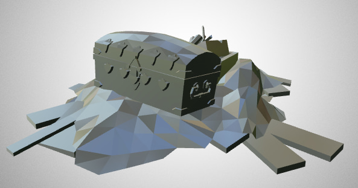

# zimodre

Convert Monster Hunter .mod files to [glTF](https://github.com/KhronosGroup/glTF).

Based on [this 3DS Max script](https://pastebin.com/EafXb2ZU) by zaramot who reverse engineered the format.

### Building

Install [zig](http://ziglang.org/) (I'm using commit hash 6663638) and run `zig build`
in this directory.

### TODO

- [x] More vertex formats
- [ ] Bones
